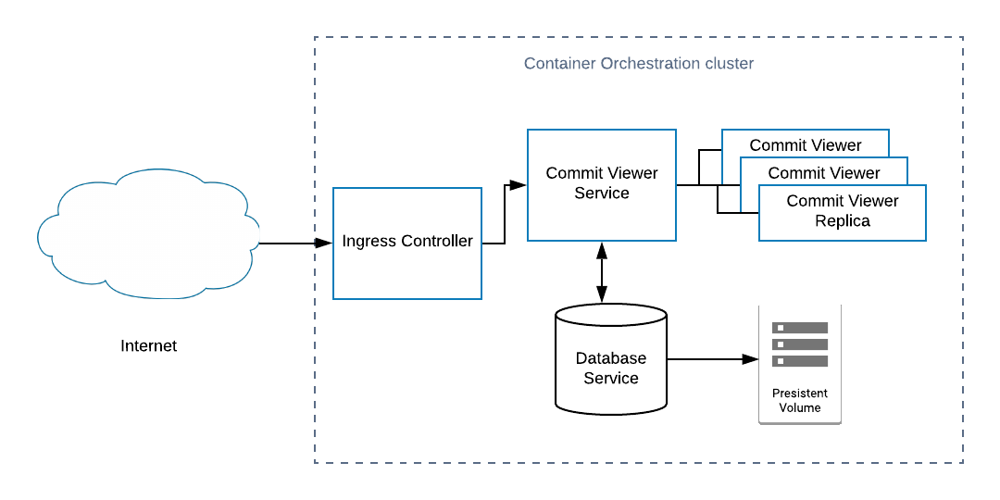

# Commit Viewer
[](https://travis-ci.com/Moser-ss/commit-viewer) [](https://sonarcloud.io/dashboard?id=Moser-ss_commit-viewer) [](https://sonarcloud.io/dashboard?id=Moser-ss_commit-viewer) [](https://snyk.io//test/github/Moser-ss/commit-viewer?targetFile=package.json)
****
## Get started: Install the CLI

### Pre-requirements
* Docker Desktop 2.0.0 or higher

### Commit Viewer  
To start the service execute the following command
```shel
docker-compose up -d
```

The ***Commit Viewer*** it will start at port ```3000``` along side the an instance of a MongoDB 
All logging will not be present in the terminal, to see the logs remove the flag ```-d```

### Monitoring
Monitor is handle by an instance of ***Prometheus***
To start Prometheus execute the following command
```shel
docker-compose -c docker-compose.prom.yaml up -d
```

The ***Prometheus*** it will start at port ```9090``` using the file in ``` ./monitor/prometheus.yml``` as source of configuration
All logging will not be present in the terminal, to see the logs remove the flag ```-d```

### Application Performance mMnagement 
APM is handle by an ***Elastic Stack***
To start ELK stack execute the following command
```shel
docker-compose -c docker-compose.eak.yaml up -d
```

The ***Elastic Stack*** it will start and the ***Kibana*** interface it will be accesible at port ```9090```
All logging will not be present in the terminal, to see the logs remove the flag ```-d```

## API

[APIARY](docs/apiary.md)


## Architecture  diagram

## Alerts

* How to avoid useless metrics (is this a thing)?
  
    A metric is only useless when cannot retrieve any information for itself or in combination with other metrics or with a context. So to determine the value of a metric we should try to understand the relation of that metric with the objects we propose for our application /system. So after that exercise, we can assert wich metrics don't give value and avoid to collect them.

* How to avoid alarm flooding?
  
    Before we create an alarm we need to think about 2 things.
    First the priority of that alarm. Like how critical is the issue the alarm is reporting for correct behavior of our application). With that prioritization adjust the notification system to notify when it is important. 
    Second, make sure the alarm report an issue that should be resolved at the moment we received and that resolution could not be handled by any automatization.

* We have a lot of metrics but no monitoring?
  
    The metrics are the raw data about the system if we don't have any platform or abstraction layer that helps us to give meaning about that data and help us to create a context we lose the reason to collect those metrics.
